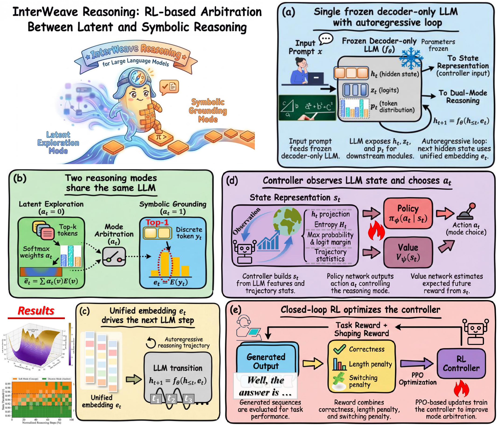
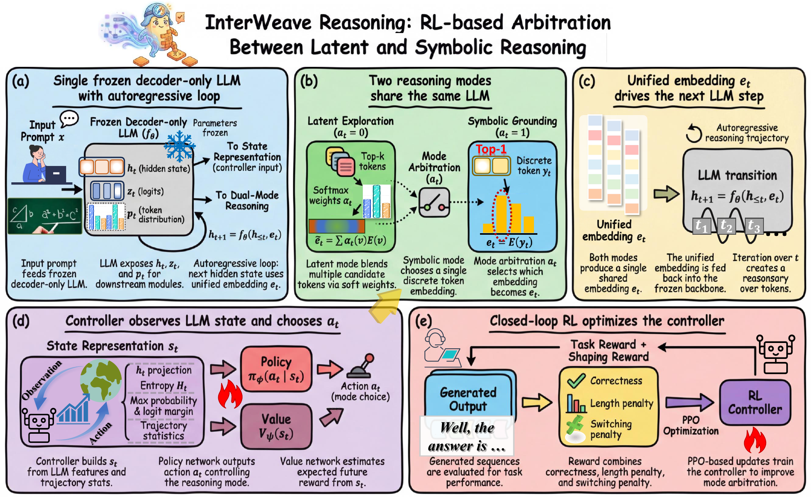
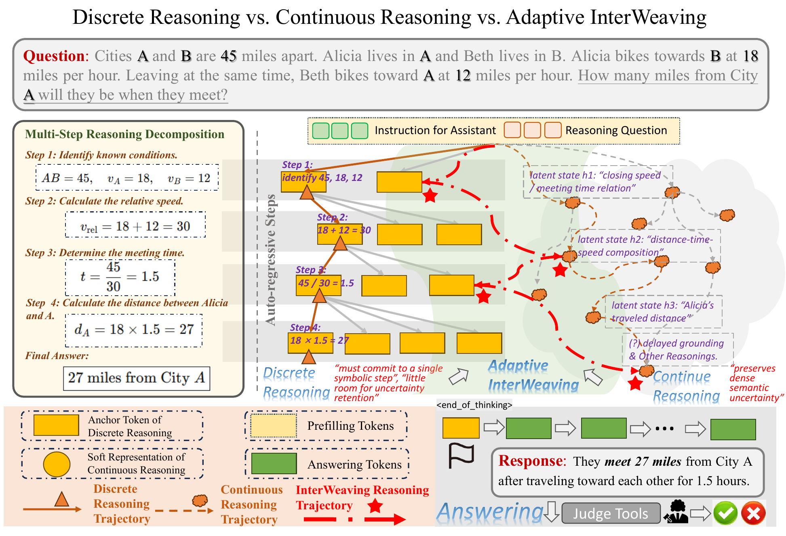
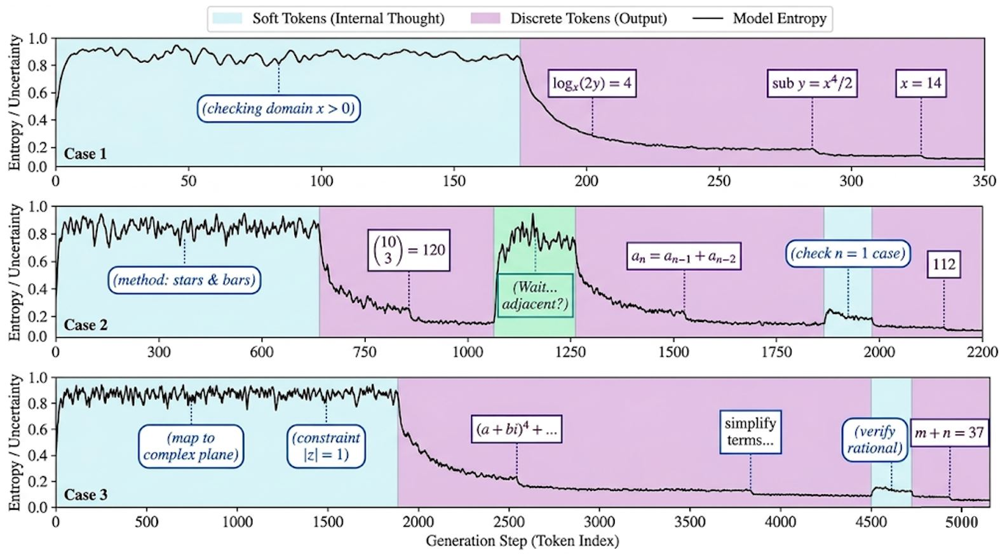
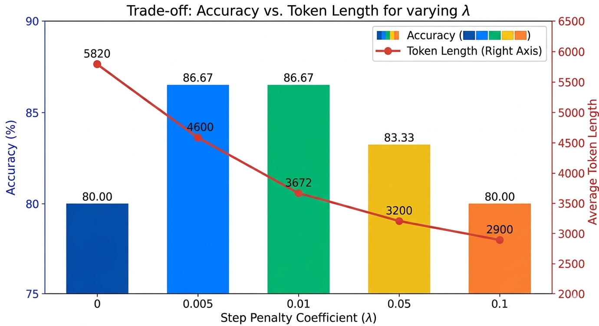
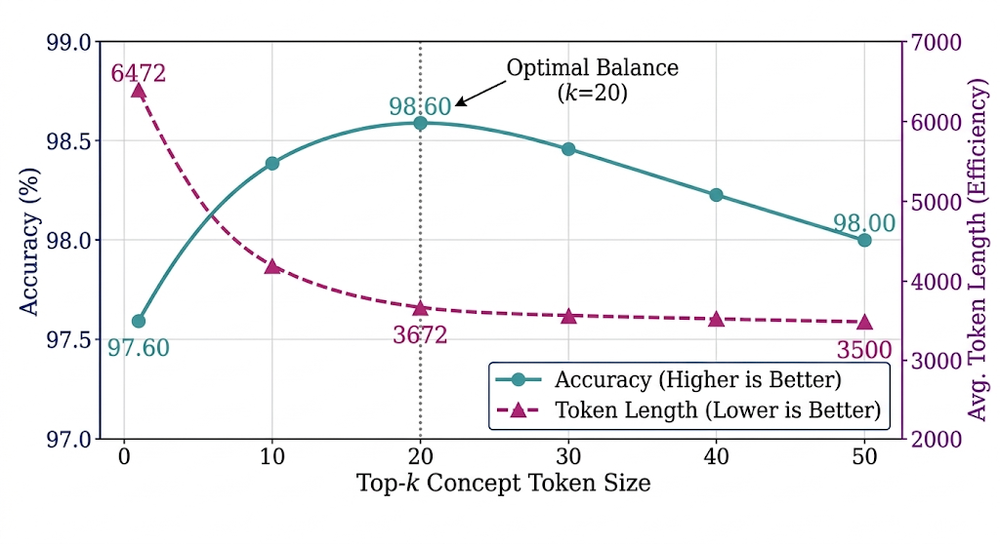
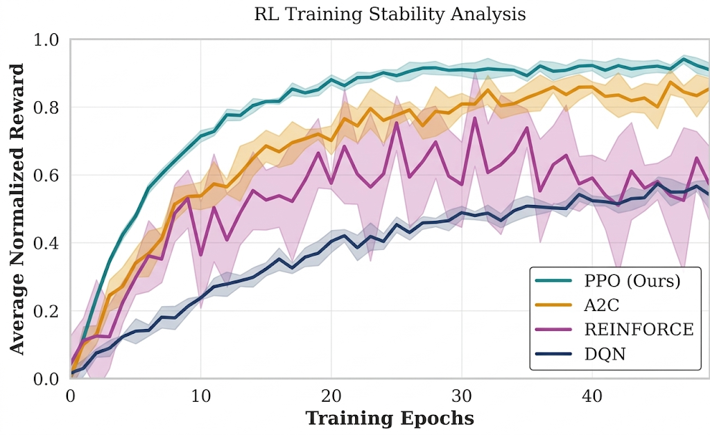
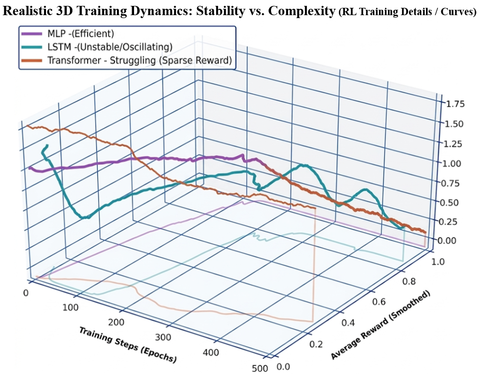

# InterWeave Reasoning

Official code release for **InterWeave Reasoning**, a framework for adaptive LLM reasoning that interleaves **Latent Exploration Mode** and **Symbolic Grounding Mode** with a lightweight reinforcement-learning controller.

The corresponding manuscript is `InterWeave-for-Neural-Networks.tex`. The codebase is adapted from a Soft-Thinking/SGLang implementation, but this repository is organized around the InterWeave formulation used in the paper: frozen backbone, top-k latent semantic token construction, learned mode arbitration, PPO optimization, Failure-Aware Replay, and Exploration-Biased Initialization.

<p align="center">
  
</p>

## What InterWeave Does

Standard chain-of-thought decoding commits to one discrete token at every step. Pure continuous reasoning can delay that commitment, but may drift away from the discrete language manifold. InterWeave Reasoning treats the choice between these two regimes as a sequential decision problem:

- **Latent Exploration** constructs a soft semantic token from top-k token embeddings.
- **Symbolic Grounding** emits a discrete token to anchor the trajectory.
- **Mode Arbitration** is handled by a small PPO-trained actor-critic controller.
- **Failure-Aware Replay** focuses updates on drift, early collapse, and difficult switching boundaries.
- **Exploration-Biased Initialization** prevents the policy from collapsing too early into discrete-only behavior.

<p align="center">
  
  <br>
  <em>InterWeave Reasoning framework: frozen LLM backbone, dual-mode transition, controller, and RL optimization loop.</em>
</p>

## Repository Layout

```text
.
├── train_interweave_controller.py     # InterWeave-named entry for controller training
├── eval_interweave_controller.py      # InterWeave-named entry for math/science evaluation
├── eval_interweave_code.py            # InterWeave-named entry for code evaluation
├── run_interweave_reasoning.py        # InterWeave-named generation entry
├── ppo_agent_model.py                 # Lightweight actor-critic controller
├── train_ppo_controller.py            # Original training implementation
├── eval_ppo_agent.py                  # Original benchmark evaluation implementation
├── eval_code_ppo_agent.py             # Original code-generation evaluation implementation
├── datasets/                          # GSM8K, MATH, AIME, GPQA, MBPP, HumanEval, LCB data files
├── scripts/                           # Shell templates for training and evaluation
├── sglang_soft_thinking_pkg/python/    # Patched SGLang runtime used for latent-token injection
├── sources/                           # Paper figures rendered for README/docs
└── readme/                            # Additional project notes
```

The SGLang runtime exposes the soft-reasoning switch as `enable_soft_thinking`. InterWeave uses that shared soft runtime to activate latent-token injection and PPO mode-arbitration hooks.

## Installation

Python 3.11 and CUDA-capable GPUs are recommended.

```bash
conda create -n interweave python=3.11 -y
conda activate interweave

pip install --upgrade pip
pip install torch transformers accelerate jsonlines math_verify openai torch_memory_saver
pip install "datasets<4.0.0"
pip install flash_attn --no-build-isolation

cd sglang_soft_thinking_pkg
pip install -e "python[all]"
cd ..
```

For LiveCodeBench evaluation, install the benchmark package separately:

```bash
git clone https://github.com/LiveCodeBench/LiveCodeBench.git LiveCodeBench_pkg
cd LiveCodeBench_pkg
pip install -e . --no-deps
cd ..
```

## Training

Edit the paths in `scripts/train_interweave_controller.sh`, then run:

```bash
bash scripts/train_interweave_controller.sh
```

The main Python entry is:

```bash
python train_interweave_controller.py \
  --model_name /path/to/model \
  --num_gpus 8 \
  --dataset_path datasets/train_gsm8k.json \
  --save_dir ppo_checkpoints/interweave_gsm8k
```

## Evaluation

Mathematics and science benchmarks:

```bash
python eval_interweave_controller.py \
  --dataset math500 \
  --model_name /path/to/model \
  --ppo_agent_checkpoint_path ppo_checkpoints/interweave_gsm8k/best.pth \
  --force_mode ppo
```

Code-generation benchmarks:

```bash
python eval_interweave_code.py \
  --dataset mbpp \
  --model_name /path/to/model \
  --ppo_agent_checkpoint_path ppo_checkpoints/interweave_code/best.pth \
  --force_mode ppo
```

To reproduce baseline-style modes, use `--force_mode hard` for symbolic-only grounding and `--force_mode soft` for latent-only traversal.

## Main Results

### Mathematical Reasoning

| Model | Method | MATH | AIME | GSM8K | GPQA | Avg. | Length ↓ |
|---|---:|---:|---:|---:|---:|---:|---:|
| QwQ-32B | CoT Thinking | 97.60 | 76.67 | 86.66 | 64.14 | 81.27 | 6472 |
| QwQ-32B | Soft Thinking | 98.00 | 83.33 | 96.82 | 67.17 | 86.33 | 5719 |
| QwQ-32B | **InterWeave Reasoning** | **98.60** | **86.67** | **97.88** | **71.72** | **88.72** | **3672** |
| DeepSeek-32B | Soft Thinking | 95.00 | 76.67 | 95.83 | 64.65 | 83.04 | 3875 |
| DeepSeek-32B | **InterWeave Reasoning** | **96.60** | **83.33** | **96.97** | **70.71** | **86.90** | **2127** |
| Llama-3.1-8B | Soft Thinking | 51.80 | 6.67 | 83.32 | 32.83 | 43.66 | 1305 |
| Llama-3.1-8B | **InterWeave Reasoning** | **55.00** | **10.00** | **86.43** | **37.88** | **47.33** | **820** |

### Code Generation

| Model | Method | HumanEval | MBPP | LCB | Avg. | Length ↓ |
|---|---:|---:|---:|---:|---:|---:|
| QwQ-32B | Soft Thinking | 98.17 | 97.67 | 62.72 | 86.19 | 4110 |
| QwQ-32B | **InterWeave Reasoning** | **99.39** | **98.05** | **72.04** | **89.83** | **2965** |
| DeepSeek-32B | Soft Thinking | 97.56 | 95.33 | 59.50 | 84.13 | 3834 |
| DeepSeek-32B | **InterWeave Reasoning** | **98.78** | **97.28** | **61.29** | **85.78** | **2729** |
| Llama-3.1-8B | Soft Thinking | 48.78 | 63.81 | 26.88 | 46.49 | 278 |
| Llama-3.1-8B | **InterWeave Reasoning** | **51.22** | **66.15** | **29.39** | **48.92** | **262** |

### Wall-Clock Efficiency

| Dataset | Method | Length ↓ | Time (s) ↓ | Speedup ↑ |
|---|---:|---:|---:|---:|
| Math500 | CoT | 6472 | 65.4 | 1.00x |
| Math500 | **InterWeave Reasoning** | **3672** | **42.8** | **1.53x** |
| HumanEval | CoT | 4899 | 49.5 | 1.00x |
| HumanEval | **InterWeave Reasoning** | **2965** | **36.6** | **1.35x** |

## Paper Figures

<p align="center">
  
</p>

<p align="center">
  
  <br>
  <em>Learned controller dynamics over predictive uncertainty and selected reasoning mode.</em>
</p>

<p align="center">
  
  
</p>

<p align="center">
  
  
</p>

More rendered figures are available in [`sources/`](sources/), including mode evolution, state-correlation heatmaps, RL manifolds, and ablation visuals.

## Notes on Reproducibility

- The frozen LLM backbone is not included; set `--model_name` to a local HuggingFace/ModelScope model path.
- The controller is intentionally small, about 0.1M parameters in the paper setting.
- Generated result files, logs, cache files, and temporary checkpoints are ignored by default.
- The patched SGLang runtime is kept in-tree so the latent semantic token path can be inspected and reproduced without carrying unrelated upstream CI, docs, benchmark, kernel, and router development assets.

## Citation

```bibtex
@article{jin2026interweave,
  title   = {InterWeave Reasoning: Adaptive Interleaving of Latent Exploration and Symbolic Grounding for Large Language Models},
  author  = {Jin, Weiqiang and Gao, Jing and Tang, Shixiang and Liu, Yang and Qi, Jinhu and Zhang, Wentao and Wang, Junli and Zhao, Biao and Yang, Guang},
  year    = {2026},
  note    = {Manuscript under review}
}
```

## Acknowledgement

This implementation builds on SGLang and a prior Soft-Thinking-style latent decoding backend. InterWeave Reasoning extends that base with learned RL mode arbitration, training/evaluation scripts, and the paper-specific experimental workflow.
